---
# Front matter
lang: ru-RU
title: "Отчет по лабораторной работе №2"
subtitle: "Информационная безопасноть"
author: "Коломиец Мария Владимировна НПИбд-01-18"

# Formatting
toc-title: "Содержание"
toc: true # Table of contents
toc_depth: 2
lof: true # List of figures
fontsize: 12pt
linestretch: 1.5
papersize: a4paper
documentclass: scrreprt
polyglossia-lang: russian
polyglossia-otherlangs: english
mainfont: PT Serif
romanfont: PT Serif
sansfont: PT Sans
monofont: PT Mono
mainfontoptions: Ligatures=TeX
romanfontoptions: Ligatures=TeX
sansfontoptions: Ligatures=TeX,Scale=MatchLowercase
monofontoptions: Scale=MatchLowercase
indent: true
pdf-engine: lualatex
header-includes:
  - \linepenalty=10 # the penalty added to the badness of each line within a paragraph (no associated penalty node) Increasing the υalue makes tex try to haυe fewer lines in the paragraph.
  - \interlinepenalty=0 # υalue of the penalty (node) added after each line of a paragraph.
  - \hyphenpenalty=50 # the penalty for line breaking at an automatically inserted hyphen
  - \exhyphenpenalty=50 # the penalty for line breaking at an explicit hyphen
  - \binoppenalty=700 # the penalty for breaking a line at a binary operator
  - \relpenalty=500 # the penalty for breaking a line at a relation
  - \clubpenalty=150 # extra penalty for breaking after first line of a paragraph
  - \widowpenalty=150 # extra penalty for breaking before last line of a paragraph
  - \displaywidowpenalty=50 # extra penalty for breaking before last line before a display math
  - \brokenpenalty=100 # extra penalty for page breaking after a hyphenated line
  - \predisplaypenalty=10000 # penalty for breaking before a display
  - \postdisplaypenalty=0 # penalty for breaking after a display
  - \floatingpenalty = 20000 # penalty for splitting an insertion (can only be split footnote in standard LaTeX)
  - \raggedbottom # or \flushbottom
  - \usepackage{float} # keep figures where there are in the text
  - \usepackage{amsmath}
  - \floatplacement{figure}{H} # keep figures where there are in the text
---

# Цель работы

Получить практические навыки работы в консоли с атрибутами файлов, закрепить теоретические основы дискреционного разграничения доступа в современных системах с открытым кодом на базе ОС Linux.

# Выполнение лабораторной работы

1.  В установленной при выполнении предыдущей лабораторной работы
операционной системе создала учетную запись пользователя guest (используя учетную запись администратора): useradd guest. Задала пароль для пользователя guest: passwd guest (рис. -@fig:001). 

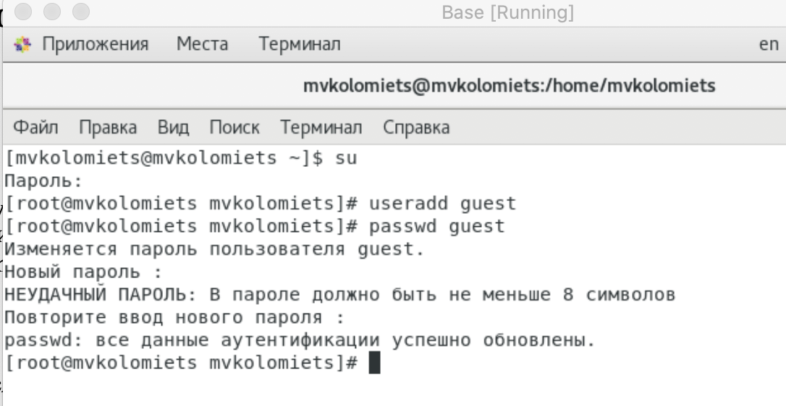{ #fig:001 width=70% height=70% }

2. Вошла в систему от имени пользователя guest. (рис. -@fig:002), (рис. -@fig:003).

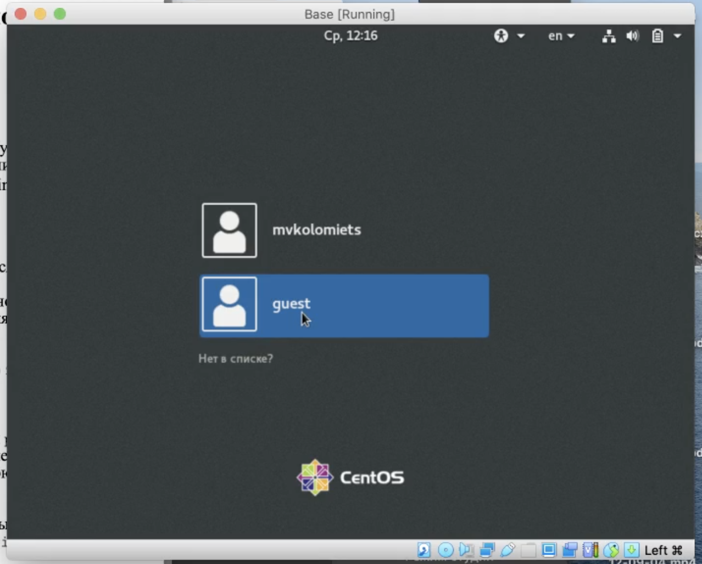{ #fig:002 width=70% height=70% }

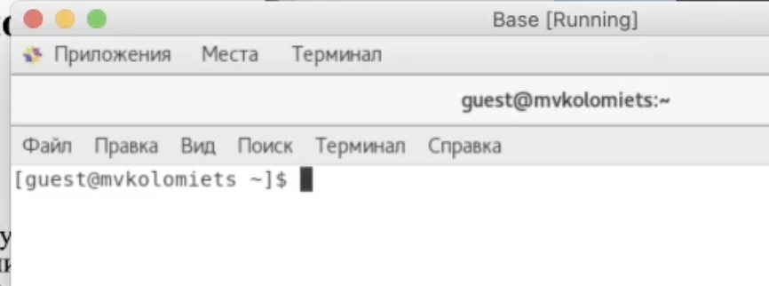{ #fig:003 width=70% height=70% }

3. Определила директорию, в которой нахожусь, командой pwd. Она является домашней директорией. Уточнила имя своего пользователя командой whoami.  (рис. -@fig:004). 

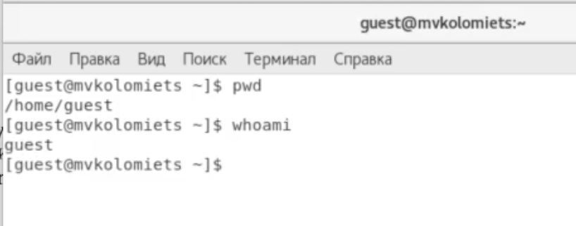{ #fig:004 width=70% height=70% }

4. Уточнила имя своего пользователя, его группу, а также группы, куда входит пользователь, командой id. Выведенные значения uid, gid и др. запомнила. Сравнила вывод id с выводом команды groups.(рис. -@fig:005). 

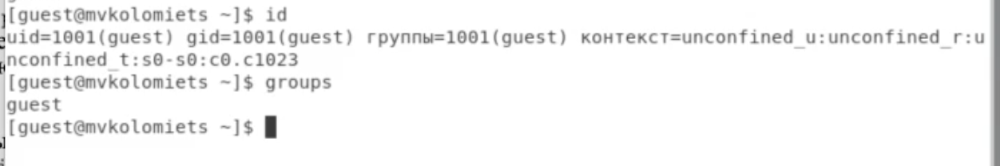{ #fig:005 width=70% height=70% }

Команда groups выводит имя пользователя.

5. Просмотрела файл /etc/passwd командой: cat /etc/passwd
Нашла в нем свою учетную запись. Определила uid пользователя. Определила gid пользователя. Сравнила найденные значения с полученными в предыдущих пунктах. (Одинаковы). (рис. -@fig:006). 

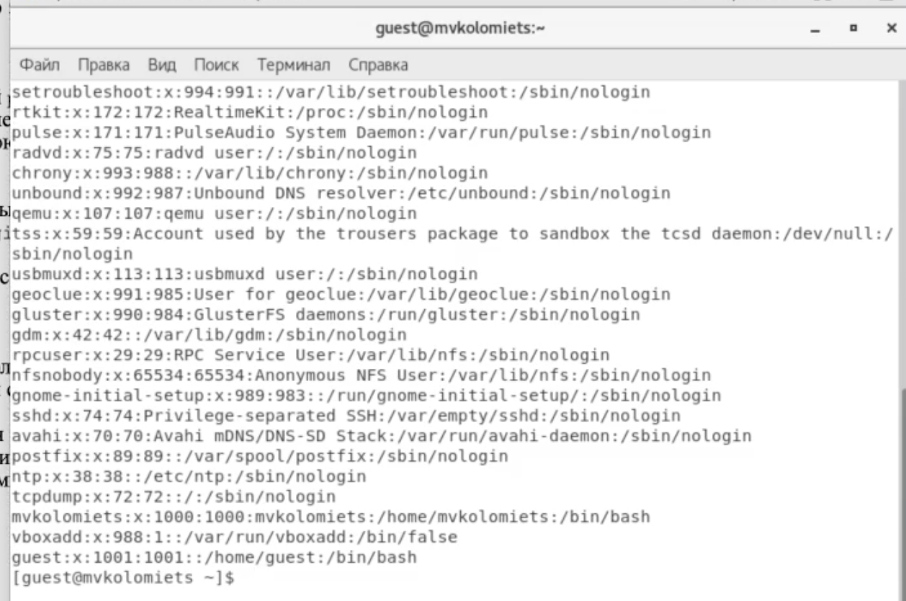{ #fig:006 width=70% height=70% }

6. Определила существующие в системе директории командой: ls -l /home/. Список поддиректорий получить не удалось, на директориях для владельца установлены права на чтение, исполнение и запись, у пользователей групп и остальных пользователей прав нет. (рис. -@fig:007).

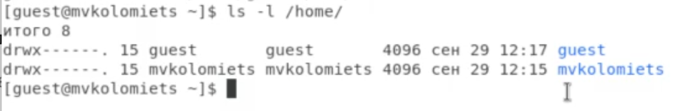{ #fig:007 width=70% height=70% }

7. Проверила, какие расширенные атрибуты установлены на поддиректориях, находящихся в директории /home, командой: lsattr /home
Нам не удалось увидеть расширенные атрибуты директории и также расширенные атрибуты директорий других пользователей. (рис. -@fig:008).

{ #fig:008 width=70% height=70% }

8. Создала в домашней директории поддиректорию dir1 командой: mkdir dir1. 
Определила командами ls -l и lsattr, какие права доступа и расширенные атрибуты были выставлены на директорию dir1 (рис. -@fig:009).

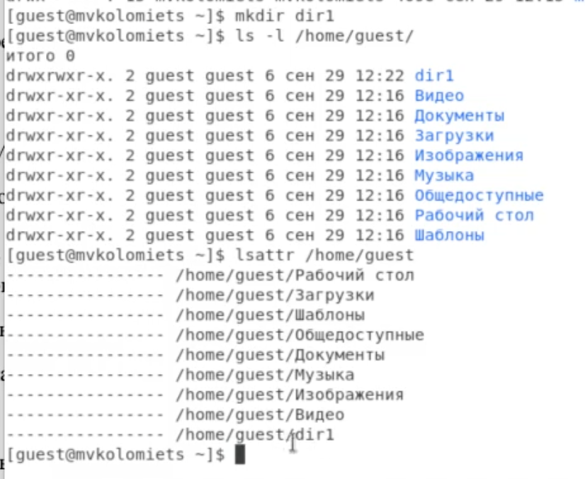{ #fig:009 width=70% height=70% }

9. Сняла с директории dir1 все атрибуты командой: chmod 000 dir1
и проверила с ее помощью правильность выполнения команды ls -l  (рис. -@fig:0010). 

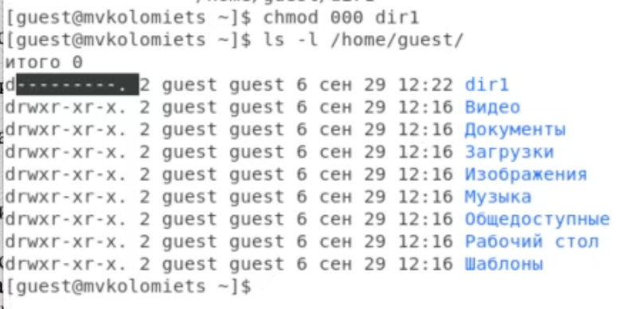{ #fig:0010 width=70% height=70% }

10. Попыталась создать в директории dir1 файл file1 командой: echo "test" > /home/guest/dir1/file1. 
Мы получили отказ, так как сняли все атрибуты и не имеем никаких прав в директории dir1. Файл не создался. Проверила командой: ls -l /home/guest/dir1 действительно ли файл file1 не находится внутри директории dir1(рис. -@fig:0011), (рис. -@fig:0012). 

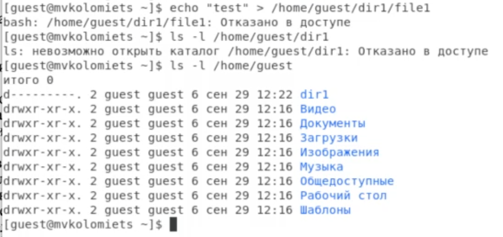{ #fig:0011 width=70% height=70% }

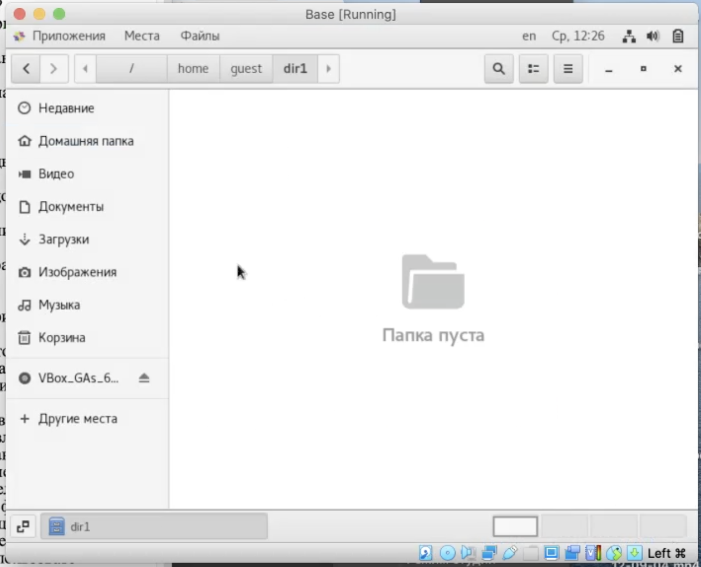{ #fig:0012 width=70% height=70% }

11. Заполнила таблицу «Установленные права и разрешенные действия»,  выполняя действия от имени владельца директории (файлов), определив опытным путем, какие операции разрешены, а какие нет. Если операция разрешена, занесла в таблицу знак «+», если не разрешена, знак «-». (рис. -@fig:0013)

{ #fig:0013 width=70% height=70% }

12. На основании заполненной таблицы определила те или иные минимально необходимые права для выполнения операций внутри директории dir1. (рис. -@fig:0014)

{ #fig:0014 width=70% height=70% }

# Выводы
На основе проделанной работы получила практические навыки работы в консоли с атрибутами файлов, закрепила теоретические основы дискреционного разграничения доступа в современных системах с открытым кодом на базе ОС Linux.