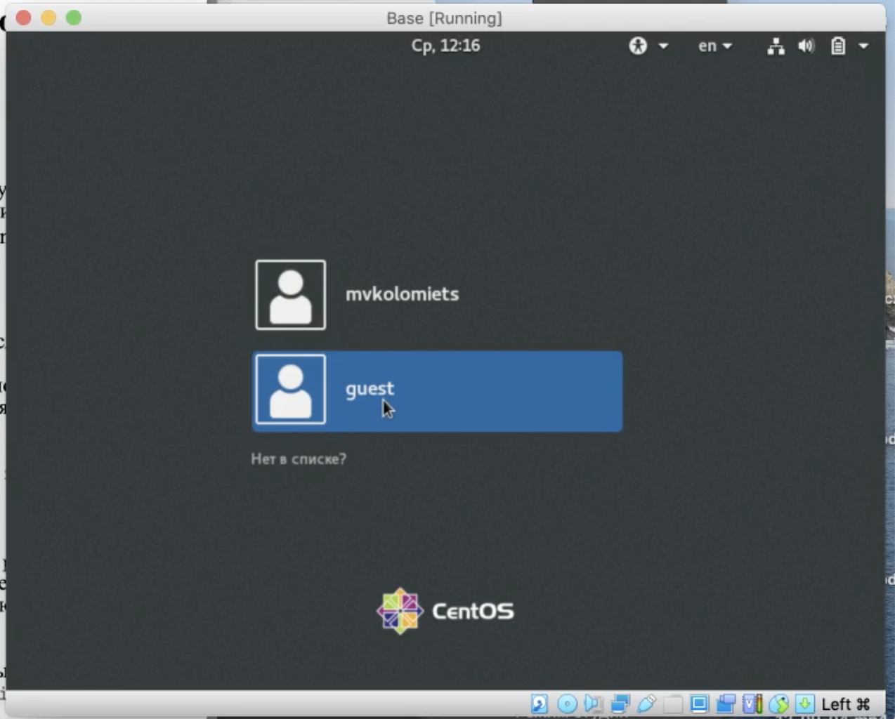
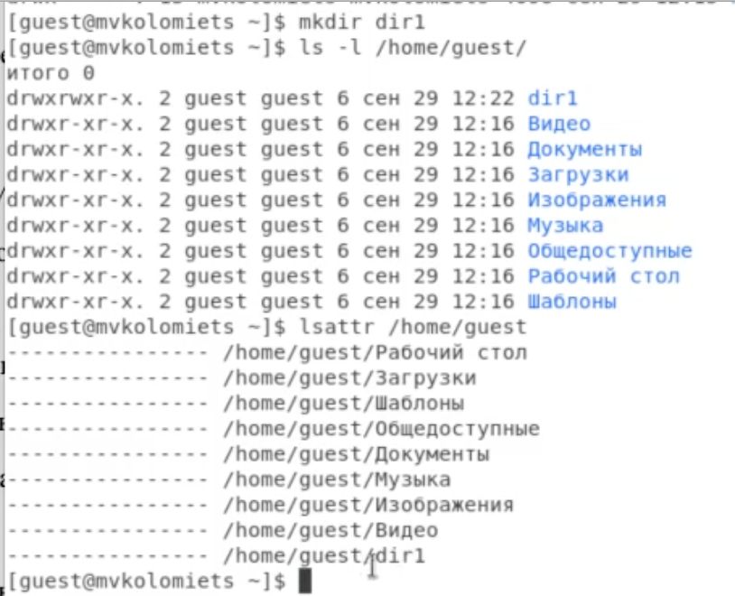
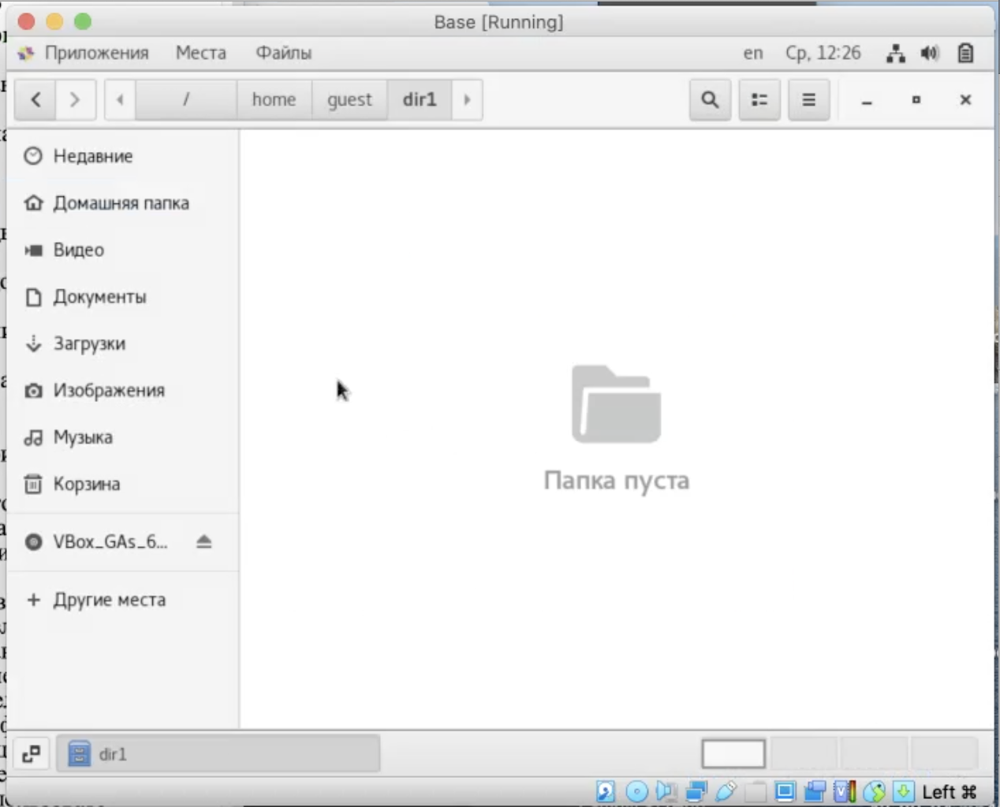

---
## Front matter
lang: ru-RU
title: Отчет по лабораторной работе №2
author: |
	 Коломиец Мария Владимировна НПИбд-01-18\inst{1}

institute: |
	\inst{1}Российский Университет Дружбы Народов

date: Информационная Безопасность--2021,  29 сентября, 2021, Москва, Россия

## Formatting
mainfont: PT Serif
romanfont: PT Serif
sansfont: PT Sans
monofont: PT Mono
toc: false
slide_level: 2
theme: metropolis
header-includes: 
 - \metroset{progressbar=frametitle,sectionpage=progressbar,numbering=fraction}
 - '\makeatletter'
 - '\beamer@ignorenonframefalse'
 - '\makeatother'
aspectratio: 43
section-titles: true

---

# Цели и задачи работы

## Цель лабораторной работы

Получить практические навыки работы в консоли с атрибутами файлов, закрепить теоретические основы дискреционного разграничения доступа в современных системах с открытым кодом на базе ОС Linux.

## Задание к лабораторной работе

Лабораторная работа подразумевает выполнение последовательно необходимых действий, чтобы получить навыки работы в консоли с атрибутами файлов. 

# Процесс выполнения лабораторной работы

## Процесс выполнения

1.   В установленной при выполнении предыдущей лабораторной работы
операционной системе создала учетную запись пользователя guest (используя учетную запись администратора): useradd guest. Задала пароль для пользователя guest

2.  Вошла в систему от имени пользователя guest. (рис. -@fig:001)

{ #fig:001 width=50% height=50% }

## Процесс выполнения

3. Определила директорию, в которой нахожусь, командой pwd. Она является домашней директорией. Уточнила имя своего пользователя командой whoami

4. Уточнила имя своего пользователя, его группу, а также группы, куда входит пользователь, командой id. Выведенные значения uid, gid и др. запомнила. Сравнила вывод id с выводом команды groups.

5. Просмотрела файл /etc/passwd командой: cat /etc/passwd
Нашла в нем свою учетную запись. Определила uid пользователя. Определила gid пользователя. Сравнила найденные значения с полученными в предыдущих пунктах

## Процесс выполнения

6. Определила существующие в системе директории командой: ls -l /home/. 

7. Проверила, какие расширенные атрибуты установлены на поддиректориях, находящихся в директории /home, командой: lsattr /home

8. Создала в домашней директории поддиректорию dir1 командой: mkdir dir1. 
Определила командами ls -l и lsattr, какие права доступа и расширенные атрибуты были выставлены на директорию dir1 (рис. -@fig:002).

{ #fig:002 width=30% height=30% }

## Процесс выполнения

9. Сняла с директории dir1 все атрибуты командой: chmod 000 dir1
и проверила с ее помощью правильность выполнения команды ls -l

10. Попыталась создать в директории dir1 файл file1 командой: echo "test" > /home/guest/dir1/file1. Проверила командой: ls -l /home/guest/dir1 действительно ли файл file1 не находится внутри директории dir1. (рис. -@fig:003).

{ #fig:003 width=40% height=40% }

## Процесс выполнения

11. Заполнила таблицу «Установленные права и разрешенные действия»,  выполняя действия от имени владельца директории (файлов), определив опытным путем, какие операции разрешены, а какие нет. Если операция разрешена, занесла в таблицу знак «+», если не разрешена, знак «-».

12. На основании заполненной таблицы определила те или иные минимально необходимые права для выполнения операций внутри директории dir1.

# Выводы по проделанной работе

## Вывод

На основе проделанной работы получила практические навыки работы в консоли с атрибутами файлов, закрепила теоретические основы дискреционного разграничения доступа в современных системах с открытым кодом на базе ОС Linux.