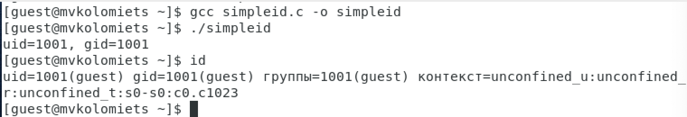
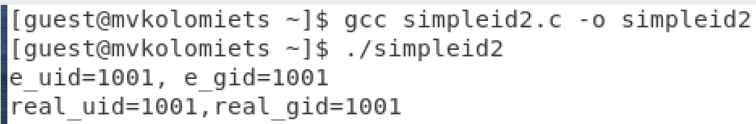
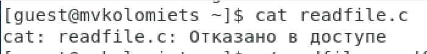
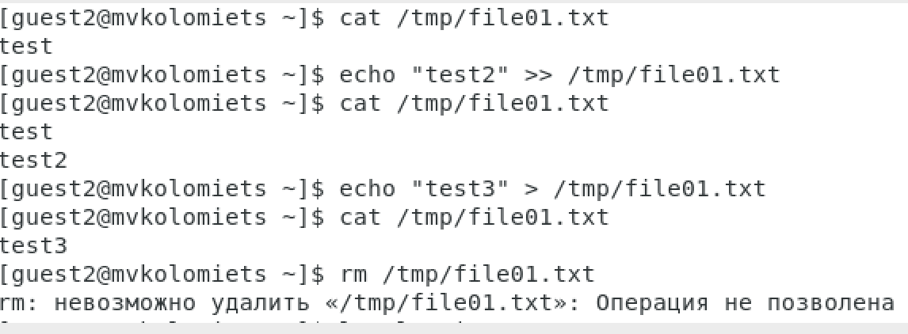

---
## Front matter
lang: ru-RU
title: Отчет по лабораторной работе №5
author: |
	 Коломиец Мария Владимировна НПИбд-01-18\inst{1}

institute: |
	\inst{1}Российский Университет Дружбы Народов

date: Информационная Безопасность--2021, 10 ноября, 2021, Москва, Россия

## Formatting
mainfont: PT Serif
romanfont: PT Serif
sansfont: PT Sans
monofont: PT Mono
toc: false
slide_level: 2
theme: metropolis
header-includes: 
 - \metroset{progressbar=frametitle,sectionpage=progressbar,numbering=fraction}
 - '\makeatletter'
 - '\beamer@ignorenonframefalse'
 - '\makeatother'
aspectratio: 43
section-titles: true

---

# Цели и задачи работы

## Цель лабораторной работы

Изучить механизмы изменения идентификаторов, применение SetUID- и Sticky-битов. Получить практические навыки работы в консоли с дополнительными атрибутами. Рассмотреть работу механизма смены идентификатора процессов пользователей, а также влияние бита Sticky на запись и удаление файлов. 

## Задание к лабораторной работе

Лабораторная работа подразумевает выполнение последовательно необходимых действий, чтобы изучить механизмы изменения идентификаторов, применение SetUID- и Sticky-битов. Получить практические навыки работы в консоли с дополнительными атрибутами.

# Процесс выполнения лабораторной работы

## Процесс выполнения

1. Вошла в систему от имени пользователя guest,  создала программу simpleid.c

2. Скомплировала программу, выполнила ее. Выполнила системную программу id. И сравнила полученный результат с данными предыдущего пункта задания. (рис. -@fig:001)

{ #fig:001 width=65% height=65% }

## Процесс выполнения

3. Усложнила программу, добавив вывод действительных идентификаторов.

4. Скомпилировала и запустила simpleid2.c. (рис. -@fig:002). 

{ #fig:002 width=70% height=70% }

## Процесс выполнения

5. От имени суперпользователя выполнила команды: chown root:guest /home/guest/simpleid2; chmod u+s /home/guest/simpleid2.  

6. Выполнила проверку правильности установки новых атрибутов и смены владельца файла simpleid2: ls -l simpleid2. Запустила simpleid2 и id.

7. Проделала тоже самое относительно SetGID-бита

## Процесс выполнения

8. Создала программу readfile.c и откомпилировала ее.

9. Сменила владельца у файла readfile.c и изменила права так, чтобы только суперпользователь (root) мог прочитать его, a guest не мог. Проверила это.  (рис. -@fig:003). 

{ #fig:003 width=70% height=70% }

## Процесс выполнения

10. Сменила у программы readfile владельца и установила SetU’D-бит.

11. Проверила, может ли программа readfile прочитать файл readfile.c (может), проверила, может ли программа readfile прочитать файл /etc/shadow.

## Процесс выполнения

12. Выяснила, установлен ли атрибут Sticky на директории /tmp. От имени пользователя guest создала файл file01.txt в директории /tmp со словом test. Просмотрела атрибуты у только что созданного файла и разрешила чтение и запись для категории пользователей «все остальные».

13. От пользователя guest2 (не являющегося владельцем) попробовала прочитать файл /tmp/file01.txt, попробовала дозаписать в файл /tmp/file01.txt слово test2. Проверила содержимое файла. Также попробовала записать в файл /tmp/file01.txt слово test3, стерев при этом всю имеющуюся в файле информацию. От пользователя guest2 попробовала удалить файл /tmp/file01.txt . (рис. -@fig:004).

## Процесс выполнения

{ #fig:004 width=80% height=80% }

## Процесс выполнения

14. От суперпользователя выполнила команду, снимающую атрибут t (Sticky-бит) с директории /tmp.

15.  От пользователя guest2 проверила, что атрибута t у директории /tmp нет. Повторила предыдущие шаги. Нам удалось удалить файл от имени пользователя, не являющегося его владельцем, также получилось выполнить дозапись в файл и замену текста в файле.

16. От суперпользователя вернула атрибут t на директорию /tmp. 

# Выводы по проделанной работе

## Вывод

На основе проделанной работы изучила механизмы изменения идентификаторов, применение SetUID- и Sticky-битов. Получла практические навыки работы в консоли с дополнительными атрибутами. Рассмотрела работу механизма смены идентификатора процессов пользователей, а также влияние бита Sticky на запись и удаление файлов.